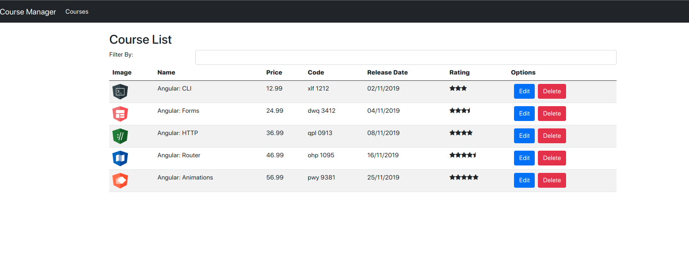
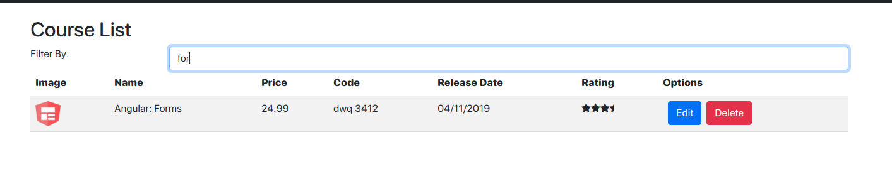
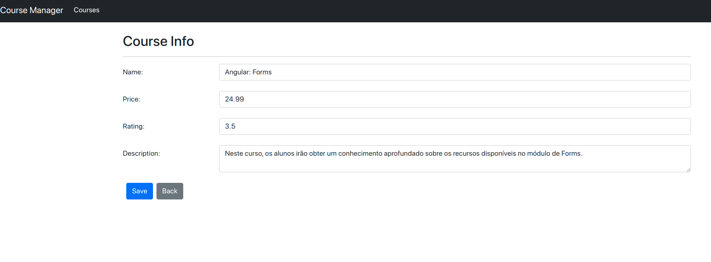

# Listagem e edição de cursos com Angular

Projeto da Digital Innovation One com intuito de introduzir conceitos básicos de Angular e consultas HTTP

## Imagens





## Como rodar

Clone ou baixe o arquivo .zip do repositório

```sh
git clone https://github.com/brenovergilio/courses-list-angular.git
```
Navegue para a pasta do projeto e atualize as dependências com o comando npm install

```sh
cd $path/course-manager
yarn
```

Inicie o servidor node para ter acesso aos cursos (se encontra na pasta src/assets/server)

```
node serve.js
```

Inicie o servidor local para rodar a aplicação

```
ng serve
```
